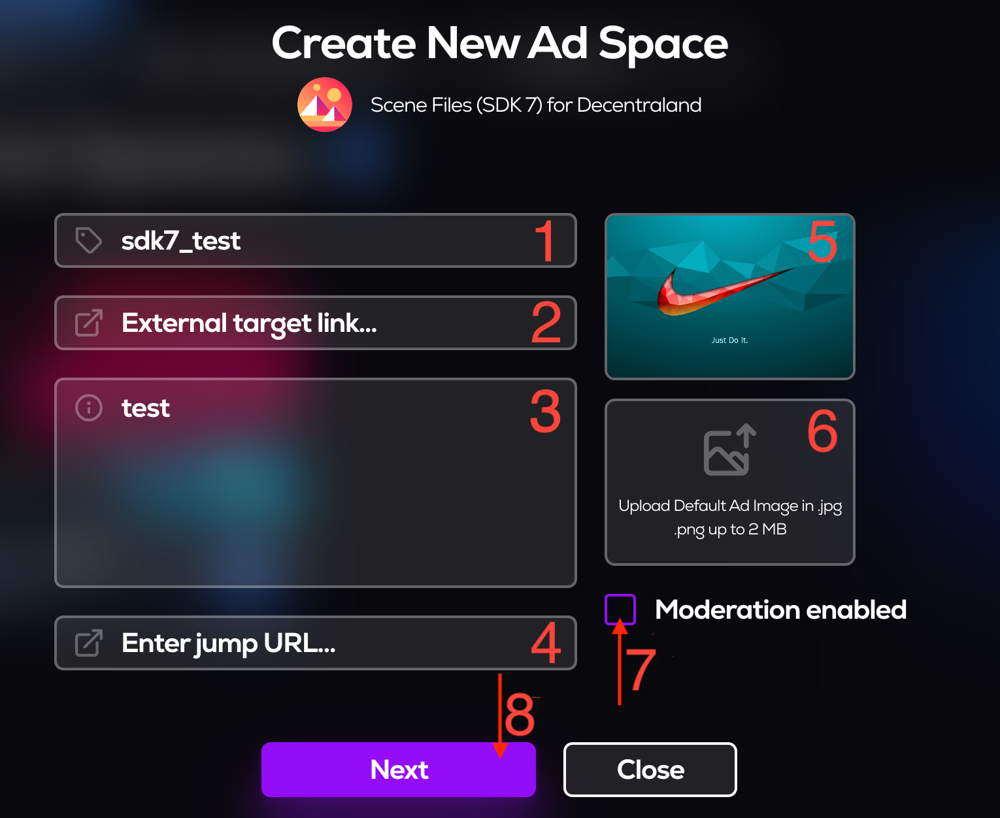
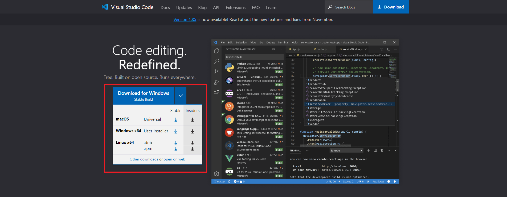
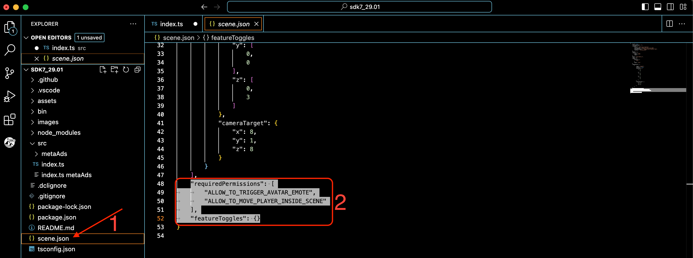

# MetaAds Decentraland's Scene for SDK7

## Introduction

This document is the instruction on how to add MetaAds SDK7 files, Typescript (Javascript + Types) to your Decentraland Scene. As a result, the back-end image/video will be displayed.

## 1. Creating an *Ad Space* on the [**MetaAds**](https://metaads.team/main/) site

* Connect
* Click on *Landowner* (1)
* Click on *My Ad Spaces* (2)
* Click on *Add Ad Space* (3)


##

* Select *Decentraland metaverse* (1)
* Select *SDK7* files in *Surface type* (2)
* Click *Download* and save the archive to your computer (3)
* Click *Next* (4)


* Enter *Name* (1)
* Enter *External target link* (Default link when clicking on the screen and it is optional) (2)
* Enter *Description* (3)
* Enter *jump URL* (Link to a scene in the metaverse and it is optional) (4)
* Upload *Preview Image* (This is the image that will be displayed on the site with the created Ad Space) (5)
* Upload *Default Image* (This is the image that will be displayed on the screen by default, if it is not there, the *Meta Ads* icon will be displayed.) (6)
* You can choose to enable *moderation* or not (is optional) (7)
* Click on *Next* (8)



* Enter *Cost per minute* on your *Ad Space* (1)
* Click on *Add* (2)


> Ready! The *Ad space* has been created and is already displayed on the page.

## 2. Working with **Visual Studio Code**

To run a scene with *SDK7* files, you need to install the [**Visual Studio Code**]([https://code.visualstudio.com/]) application. 

* Select your OS and download it.


##

* Open *VSC*
* Click on *Extensions* icon (1)
* Click on *Search* field (2)
* Enter *SDK7* 
* Click on *Install* (3)


##

* Click on *DCL* icon (1)
* Click on **Open Folder** (2)
    
> Create an empty folder and open it. 


##
> If you already have a project with SDK7 files, then you need to open it by clicking the Open button and select the folder with these files.
* Click on *DCL* icon (1)
* Click on *Create project* (2)
* Click on *Standart project* (3)

> Wait for downloading and installing.


##

* Click on *Explorer* icon
* Delete the files selected in the screenshot (2) 


> * Copy the files from the downloaded archive from *MetaAds*
> * Paste in *Source(src)*
##
> Go to the *MetaAds* site and open your *Ad Space* with a click

* Copy *Ad Space PIN*


> Go back to the *VSC* 

* Open *index.ts* file (1)
* Paste the *PIN* into the selected line in the screenshot (2)


##

* Open *scene.json* file (1)
* Replace the selected part of the code with (2):

```
"requiredPermissions": [
    "ALLOW_TO_TRIGGER_AVATAR_EMOTE",
    "ALLOW_TO_MOVE_PLAYER_INSIDE_SCENE",
    "ALLOW_MEDIA_HOSTNAMES"
],
"allowedMediaHostnames": [
    "metaads.team",
    "meta-dev.eastrelay.com"
],
```


> Now you can run your scene.
##

* Click on *DCL* icon (1)
* Click on *Run Scene* (2)


> Wait for downloading. *VSC* will open a new tab with your scene.


##

> You can also open the scene in a browser.

* Click on 3 dots in *Editor* (1)
* Click on *Open in Browser With Web3* (2)


